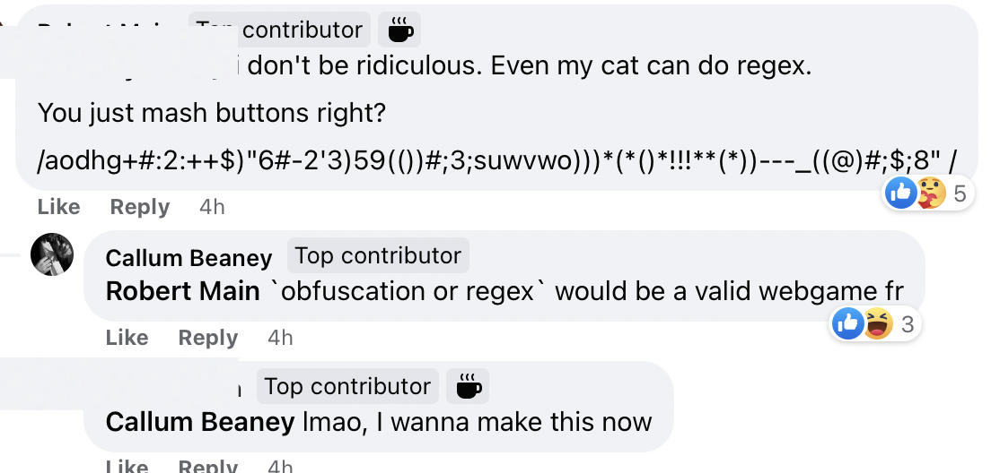

# program-ideas
An unordered list of program ideas that pop into my head, Serious and Stupid alike.  
If you happen to read this and want to make something before I get to it, go ahead! But please do PR with a link to it; I'd love to see it. Or if you're up to collab and do it together, even better.  

[brief ideas](#brief-ideas)  
[long ideas](#long-ideas)  
  

## brief ideas

- **math & interesting historical counting system(s)**  [more here](https://osf.io/z9ux5)   
  Terminal programs, little websites. Focus on historical value. Try to use less familiar langs like Haskell or Julia.
  - [Cistercian Numerals](https://www.unicode.org/L2/L2020/20290-cistercian-digits.pdf)
  - [Mangarevan Binary](https://en.wikipedia.org/wiki/Mangareva#Binary_counting_system), [2](https://www.nature.com/articles/nature.2013.14380), [3](https://www.youtube.com/watch?v=hewNo1Qp9rg)  
  - Russian Peasant's algorithm ([DONE in C](https://github.com/CallumBeaney/Russian-Peasants-Algorithm))
  - Goldbach's Conjecture ([DONE in C](https://github.com/CallumBeaney/Goldbach-Checker))  
<br>
- **age calculator** e.g. `howold 12/4/1974` -> outputs age because opening google and navigating to some BS calendar-form-input website with cookies message popping up each time is annoying af  
  
- **what's the weather like at {POSTCODE || CITY}?**  same reasons as above.  

- [FUR BUILDER](https://callumbeaney.github.io/pages/singlesurface/singlesurface.html): generate a grid dynamically in a single page of [fur](http://kitagawakoji.com/fur.html). Use chess knight patterns. Pitch to Koji.  
  
  
- **a diatonic harp tuner**  
Harpists usually use chromatic tuners but variable string numbers & ranges complicates things for beginners.  
`Webpage. Asks user if they know the most high & low pitches of their harp. If not: Requests low tone over microphone. Requests high tone over microphone. Generates a zoomable diatonic harp graphic (like the Guinness logo) the low:high-corresponding string range of which can be clicked to sound a MIDI tone`.  
  
- **pointers explained**  
A webpage that explains how pointers work in C graphically based on a user making subtle changes to the syntax in a pseudo code editor. Basically a quick type-along walkthrough to clear up terrible metaphors and show precisely what is happening on the language's own terms.
```              
    int(*p)[5] = &a; // use & and whole array is called
    where VARIABLE in [ printf("%d", VARIABLE); ] is one of the 3 below "p" declarations.

              **p
     ┌────────┼───────────────────────────┐
     │        │                           │
     │     ┌──┼─┬────┬────┬────┬────┐     │
   a │     │  ▼ │    │    │    │    │     │
     │     └────┴────┴────┴────┴────┘     │
     │     ▲                              │
     └─────┼──────────────────────────────┘
     ▲     │
     │     └───────────┐
     p                *p
``` 
  ^^ alternatively, extend this by having a humorously willy-themed website that explains this exact concept with graphic NSFW art called `*p is stored in the balls`.  
  
- **encrypter**  
Give a textInput some text & select a hashing algorithm from a dropdown e.g SHA-1, MD-5 etc and return the output.  
  
- **Image to ascii** using [Braille](https://unicode.org/charts/nameslist/c_2800.html) `⠿⠽⠶⠭⠀`  or  `█▓▒░ `.  Braille unicode at sufficiently large sizes speculatively resembles offset printing however testing will be required. Export result as a PDF appropriately scaled so that it can be viewed like an image.
  

  
- "**A historical language-related tool**  that I would like to see in the future, if possible, would be something that allows its users to look up more effectively spelling variants of the same words (always making reference to their first written attestantions too), or specific speech sounds, across different manuscripts from similar time ranges and geographic origins. That way, as I see it, it would be easier to see the spread of certain phonological changes, or how spelling standardisation comes about in this or that region or time." -- Effi96  
  
- **bonfire** A terminal art program that generates a smoking bonfire like in Dark Souls. API fetches quotes from the game and slowly cycles through them. For functionality’s sake, this could be used as a kind of program or system snapshot that can be referenced (rather than strictly returned to).

- **Night Sky** -- a terminal/GUI that basically maps the night sky's stars where the user is, and lets them explore it in glorious ASCII form. More art/cute than anything useful.  Check [this](https://astronomyapi.com) and [this](https://docs.astronomyapi.com/endpoints/bodies)
and Postman and research RapidAPI. And use [this](https://paw.cloud).  

- **"pawns"** which is chess, but only with pawns, and even though this is almost essentially checkers, you deliberately avoid that fact.  

- **this thing**  ( see: [this](http://pixelastic.github.io/pokemonorbigdata/) )  

    
- **GODE CODE** programming language. Python but middle english. Allows for multiple spellings just like the historical lexicography.   
  
- **Have A Word With Yourself** -- webapp that one would send to somebody being a fool on social that opens their front camera, shows them their own face, and puts up a text popup saying "have a word with yourself" (Andrew Maxwell on 810cats S14E8)  
  
- **LIU BO**  --  ancient chess game. Reconstruct speculatively or wait till [This Research](https://www.zhihu.com/question/47845602) comes back.  

- **RE: PEOPLE** -- "Make this into a Slack plugin which checks your DMs and allows to do the same using Slack UI/commands. Now that would be a banger. Add Google Calendar integration and you have a product"

- **PICO motion activated speaker** that makes someone jump by playing a soundbite e.g. [this](https://www.youtube.com/watch?v=siLkbdVxntU) when someone trips it walking into a room etc etc. good motion sensor [here](https://www.tomshardware.com/how-to/raspberry-pi-pico-motion-sensor). Will need speaker & a Extend with battery supply.  
<br>
  
  
## long ideas  

### Classical Chinese Reader     
Receives Chinese text and supplements reading with fast access to definitions & grammar glosses by clicking on hanzi or groups thereof.  
  
WHY  
Traditional dictionary lookup slow. Definitions sometimes don't explain classical grammar and usage clearly (no differentiation between modern usage and old).	There are mouse-mounted dictionaries such as Zhongwen. However, they do not differentiate between dictionaries and are extensions; program wanted.   
  
Probable Classical Chinese grammar is highlighted & when clicked user provided with glosses for truncations and modern analogues. Same for Historically-notable and significant references (names, phrases, hanzi with special connotations).  User can click on hanzi to get definitions and pronunciations in different dialects.  

<br>

### JAPANESE/CHINESE KANJI STUDIER  
“dismantles” a given Chinese character and provides glosses to a user such that they may comprehend its historical phonetic & linguistic changes through multiple East-Asian languages. In some ways this is Wikitionary but presented less noisy and slightly curated and without the faff of trying to remember how to spell wiktionary or wikitionary or wikititionary 
  
WHY  
English-speaking people learning either Japanese or Japanese & Chinese will benefit from knowing a Japanese loan-character’s predecessor. Chinese learners of Japanese often rely too heavily on assumptions they make about Japanese words and their meaning. Japanese students of Chinese will by virtue of their study benefit from a comprehensive resource, and understand pronunciation rules.  
   
<p>PROCESS</p><ol><li>Program receives a logogram. <ol> <li>OR word for the meaning of that character in EN/JP </li></ol><li>Program searches character against databases and retrieves and then displays the following information: <ol> <li>The same character <li>All alternative forms accessible in character sets e.g. Modern Japanese form, historical Japanese form, traditional Chinese form, Chinese simplified form. <li>Information: <ol> <li>Meaning in both languages <li>Written Pronunciations in both languages: <ol> <li>Japanese Kana and <a href="https://en.wikipedia.org/wiki/International_Phonetic_Alphabet">IPA</a> <li>Chinese’s Pinyin and IPA <li>Other dialects of Chinese e.g. Cantonese and IPA</li></ol> <li>A sound recording (internet access only) that generates a pronunciation of one of the above. <li>A graphic breakdown: <ol> <li>A breakdown of the character’s pronunciation in Chinese, giving access to the character’s individual components (radicals) and hanzi in that character’s phonetic series e.g. 見 俔 蜆 硯 哯 <li>A simultaneous comparison of pronunciations of the same Japanese characters [if a character is not used in Japanese, then skip over it but note its absence with a ＊]. </li></ol> <li>Examples of usages e.g. Japanese has multiple pronunciations; native Japanese appellations can be noted separately, as Chinese-derived pronunciations are the focus.</li></ol></li></ol><li>Program lays out in a simple user interface.</li></ol><p>The idea is that the program gives a LOT of information that can be selectively included in a user interface. This way, the way the word has been adopted into Japanese and the way the word’s meaning has changed can both be compared.</p>
